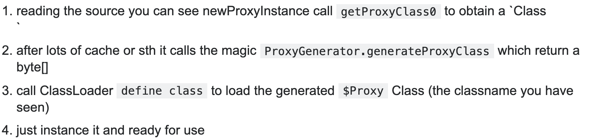
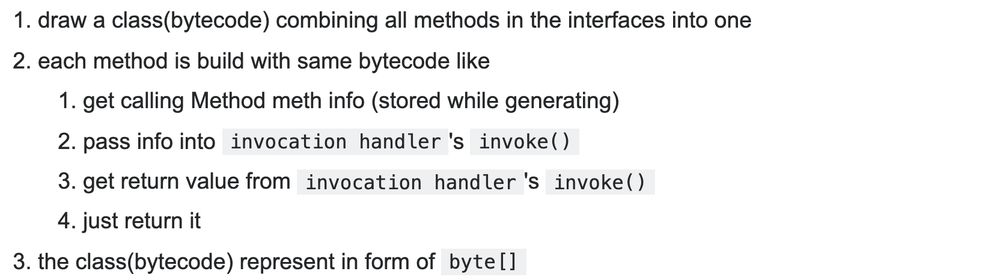

# 基于动态代理实现Hook系统服务

## 动态代理

动态代理是在程序运行时运用反射机制动态创建生成代理类。Java的动态代理主要涉及两个类，Proxy 和 InvocationHandler。

* Proxy 用于为接口生成动态代理类及其对象。
* InvocationHandler 提供了 invoke 方法，负责集中处理动态代理类上的所有方法调用。

实现的具体步骤：

1. 获取需要代理的类的实例。
2. 实现 InvocationHandler 接口创建自己的调用处理器，实现 invoke 方法，通过 method.invoke(apple, args) 调用被代理类。
3. 通过 Proxy.newProxyInstance 方法并指定 ClassLoader 对象和一组 interface 以及 指定 invocationHandler 对象来创建动态代理类。
4. 通过反射机制获得动态代理类的构造函数。
5. 通过构造函数创建动态代理类实例，构造时调用处理器对象作为参数被传入。

关于Proxy类的具体说明[Class Proxy](https://docs.oracle.com/javase/7/docs/api/java/lang/reflect/Proxy.html#newProxyInstance(java.lang.ClassLoader,%20java.lang.Class[],%20java.lang.reflect.InvocationHandler))。

## 内部原理

就是动态代理怎么执行到invoke方法的呢，我们看下调用栈：

在调用`java.lang.reflect.Proxy#newProxyInstance`后发生了什么呢？

在`sun.misc.ProxyGenerator`里又发生了什么呢？

## 缺陷

Proxy虽然使用起来很方便，但它的设计使得它只能支持interface的代理，不支持实现类的代理。